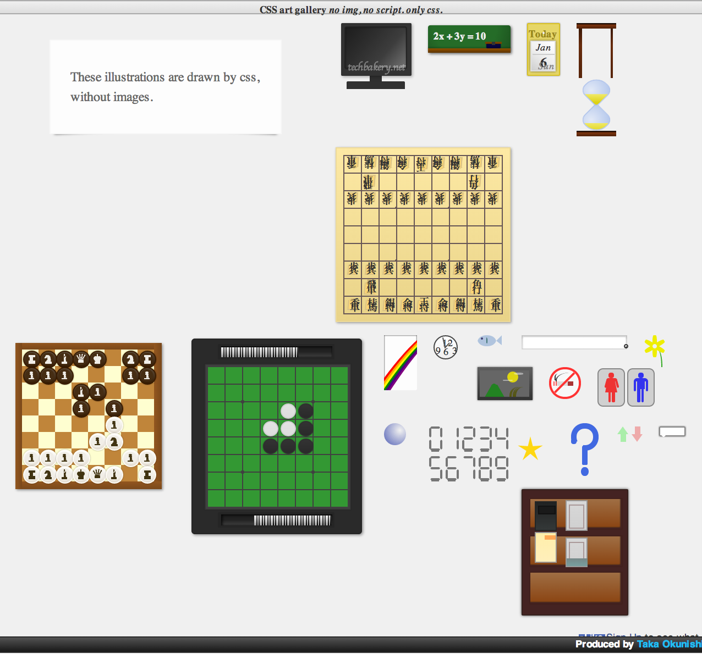

css-art-gallery
===========

CSS design art gallery.

All illustrations are drawn in pure css, without any image.

[css-art-gallery]: http://okunishinishi.github.io/css-art-gallery/

## [View it now!][css-art-gallery]

[][css-art-gallery]

Donation
-------

[gittip-okunishinishi]: https://www.gittip.com/okunishinishi/

Support this project and [others by okunishinishi][gittip-okunishinishi] via [gittip][gittip-okunishinishi].

[][gittip-okunishinishi]

License
-------
This software is released under the [MIT License](https://raw.github.com/okunishinishi/css-art-gallery/master/LICENSE).
